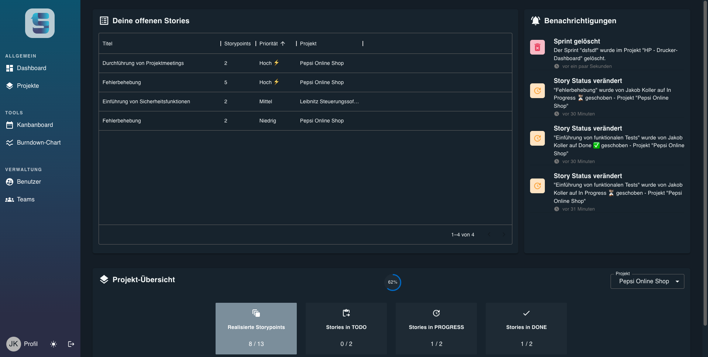

# Sprintify

This full-stack web application was developed as a part of a university course. The objective was to create a tool that supports agile development teams.

## Core functionalities

- Project Creation
- Sprint scheduling
- Burndown Charts
- interactive Kanbanboard
- Notifications
- Dark/light mode

## Information

The application was build using React + MUI for the frontend and Express for the backend. For the database we used MongoDB which was hosted on MongoAtlas while developing the application.  
**ATTENTION:** The application was build with little/none knowledge of React or JS beforehand. At the end we were very pleased with the result, but codewise its beyond perfect or stable.

## Settings

In the `.env` file in the root directory there are settings that must be set before starting the application.

`beActiveOnRegister` can be set to either true or false. This controls whether a user is automatically activated after registration. This makes testing way easier, because you don't need to have a valid university email on hand.

`emailRegex` follows a similar principle, if you set it `true` you can only create an account with a vaild university email.

## Production Build

Adjust Ports and URLS in the`.env` file.

`docker-compose -f docker-compose.prod.yml up --build` 

## Development Build

Adjust Ports and URLS in the`.env` file.

`docker-compose -f docker-compose.yml up --build`

